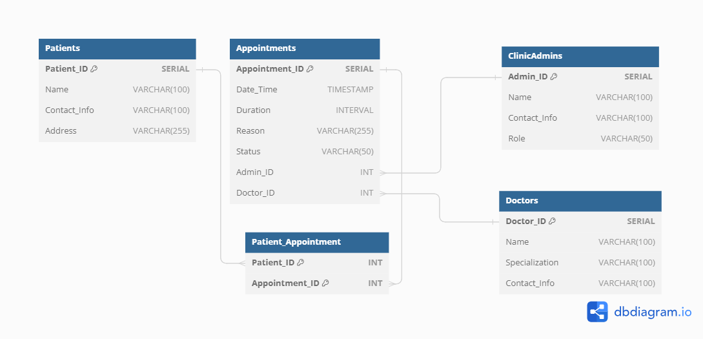
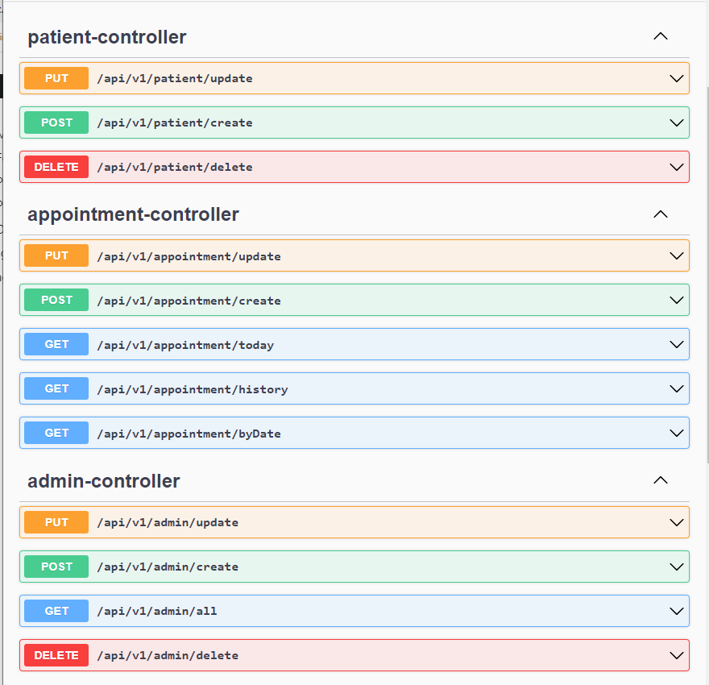

# Medical clinic appointment management system

This system is developed using Spring boot framework

TODO :
1. spring cloud
2. GraphQL
3. unit test **Junit**
---
The schema design for the project is :

---
The apis implemented in the project according to the task are documented using swagger open api:

